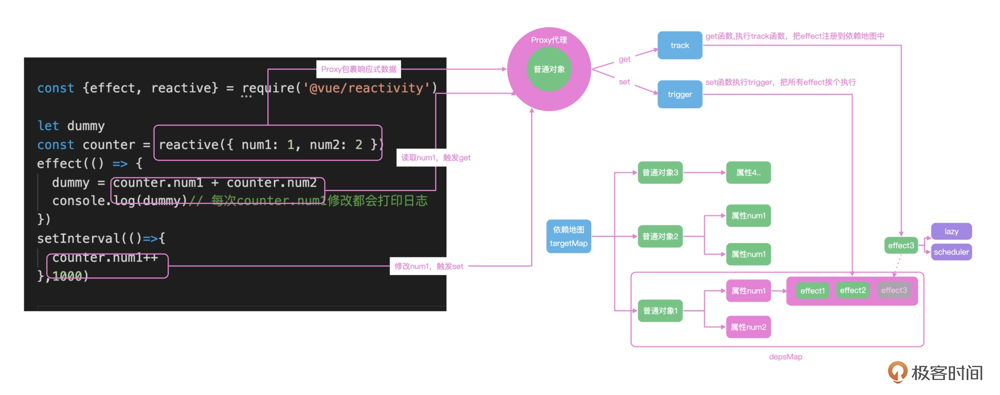

# vue 源码解读
    - vue3 响应式
        - reactive 
        - effect 更新依赖收集
    - 虚拟dom 跨平台性能优化
    - diff 算法

- 响应式
    - 优点
        - 远离DOM api的约束，专注业务开发(函数抽象)，更好更快
        - 组件间通过响应式机制来通知 effect
            - 单组件:
                reactive({
                    list:[]
                })
                组件挂载在页面之前 {{list}} -> proxy get
                - template {{list}} proxy set 自动更新
                    get 会添加依赖  set 时执行依赖
                - computed
                - watch watchEffect
                    proxy get 添加依赖 set执行回调函数
                - onUpdated

## 平台无关性
- SPA vue .html文件
- uniapp  vue 做小程序  .wxml文件
- react native ios/android app  .o .java .xml
相同点: 都是响应式 都是UI界面
不同点: 不同产品和平台

template({{list}}) <-> VDOM(VNODE 内存中,proxy) -> mounted(DOM/WXML/XML, 根据平台编译)

template:
    <ul>
        <li v-for="item in [1,2,3]">{{item}}</li>
    </ul>

VDOM:可以表达ui的语言
    {
        type:'element|component',
        props:{
            id:'',
            class:'',
            data:''
        },
        children:[
            {
                type:'element|component',
                props:{
                    id:'',
                    class:'',
                    data:''
                },
                children:['1']
            }
        ]
    }

DOM:
    <ul>
        <li>1</li>
        <li>2</li>
        <li>3</li>
    </ul>

- reactivity
    - reactive 将对象封装成proxy包裹的响应式对象
    - effect 读取数据时触发reactive的proxy的get方法(track)，将effect回调注册到targetMap中
             修改数据时触发reactive的proxy的set方法(trigger)，将targetMap中的对应对象的effect回调
    
    - lazy 是否立即执行effect回调
    - scheduler 运行顺序

